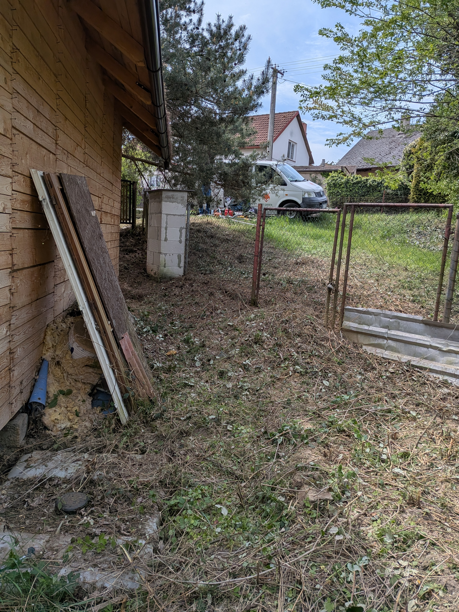

# Návod: Jak přidávat další ukázky (PŘED a PO) na web

Aby nová sekce „Proměny zahrad“ fungovala správně a jednoduše, držte se tohoto postupu. Vše je navrženo tak, abyste nemuseli složitě programovat.

## 1. Jak připravit fotografie
Fotografie uložte do složky `/images/realizace/`.
Vždy potřebujete jednu fotku "PŘED" a jednu "PO" pro každou zakázku.

**Pravidla pro fotky:**
- Ideálně by měly být vyfocené ze stejného úhlu a místa.
- Všechny by měly mít poměr stran ideálně 16:9 (na webu se jinak automaticky oříznou).
- Ujistěte se, že nejsou příliš velké (doporučeno do 500 KB na fotku, aby se web načítal rychle).

## 2. Jak pojmenovat fotky
Udržujte jednotný systém číslování (zakazka1, zakazka2, zakazka3...).

- Fotka před úpravou: `zakazkaX-pred.jpg`
- Fotka po úpravě: `zakazkaX-po.jpg`

*(Příklad pro pátou zakázku: `zakazka5-pred.jpg` a `zakazka5-po.jpg`)*

## 3. Jak přidat novou zakázku na web (do souboru index.html)
Otevřete si soubor `index.html` v libovolném textovém editoru a najděte sekci začínající `<div class="ba-thumbnails" id="ba-thumbnails">`.

Uvidíte tam seznam náhledů (miniatur), který vypadá nějak takto:

```html
<div class="ba-thumb" data-before="images/realizace/zakazka3-pred.jpg" data-after="images/realizace/zakazka3-po.jpg">
    
</div>
```

Pokud chcete přidat další (čtvrtou) ukázku, stačí pod tu poslední zkopírovat stejný kód a přepsat čísla z 3 na 4. Bude to vypadat takto:

```html
<div class="ba-thumb" data-before="images/realizace/zakazka4-pred.jpg" data-after="images/realizace/zakazka4-po.jpg">
    
</div>
```

**Hotovo!**
Hlavní slider (velká fotka, se kterou se tahá) zůstává stále stejný – o výměnu velkých fotografií se stará naprogramovaný systém sám. Stačí takhle jednoduše přidávat miniatury a dodržet pojmenování fotek ve složce `images/realizace`.
